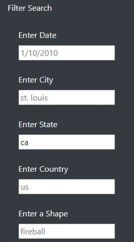

# UFO_Sightings
A page to filter and search a database of UFO sightings.
https://rhettcili.github.io/UFO_Sightings/

## Overview
This project is built to be able to filter the data of the many UFO sighting based on more specific criteria within each sighting. This will make it easier to find UFO sightings based on what you're looking for, rather than having to read through every single one trying to find a match. 

## Results
Lets say you're looking for only UFO sightings in a certain state, such as California. You can use the filter search tool to narrow down the UFO sightings to match just that. You'd first go over to the 'Filter Search' tool over to the left side of the page. Enter the desired state in the 'Enter State' section, like so:

And this will limit the UFO sightings to only those that happened within California. 

## Summary
One major drawback of this new webpage is the limited information that comes with each UFO sighting incident. You may be able to search through the data to find specific sightings based on the new filters, but the information on each sighting is still very limited. Two recommendations I'd make for a future webpage is adding in a source to make these sightings more credible, as well as adding links to the original source, so that our curious clients can explore deeper into interesting sightings they've pulled up.  
